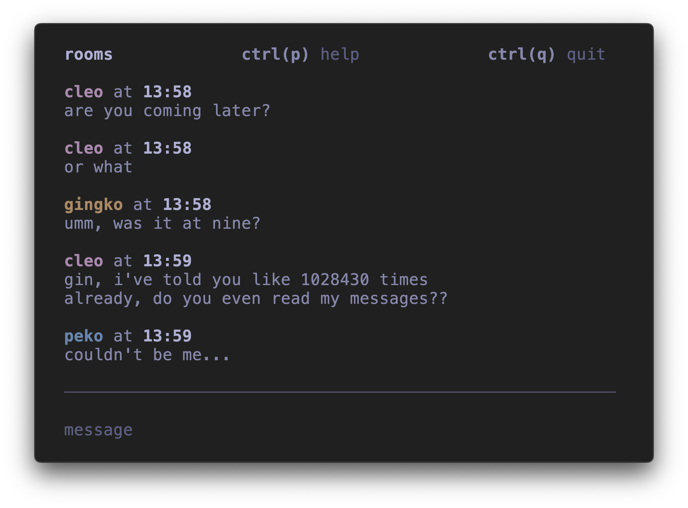
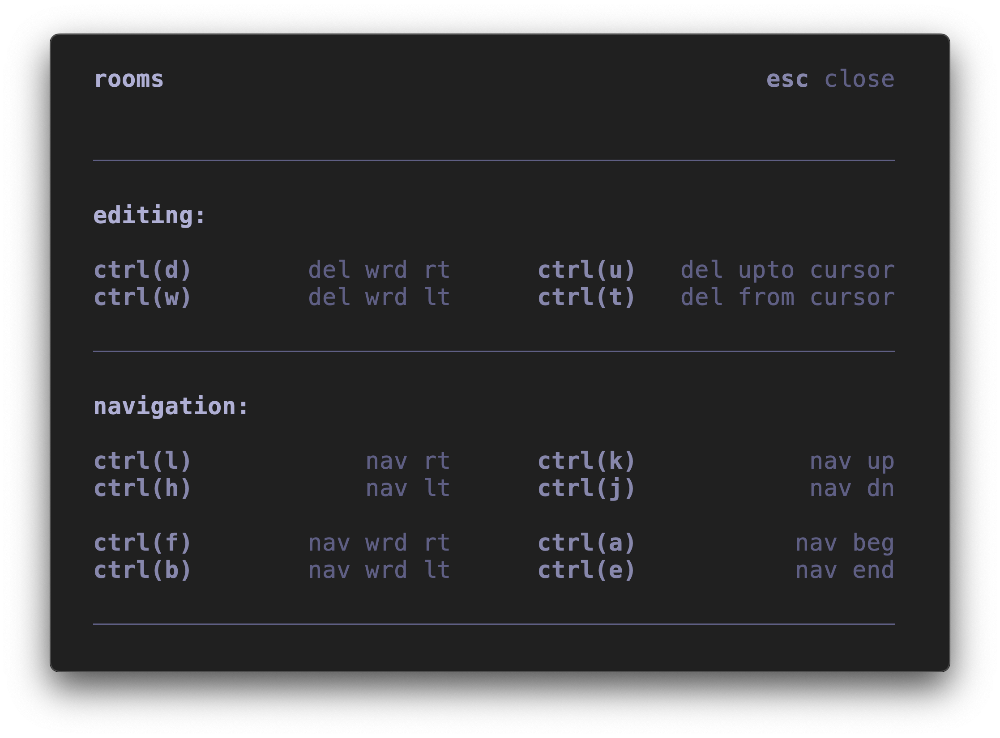

# rooms

rooms is a self hosted terminal messaging app. \
rooms doesn't use any external libraries.      \
rooms is fast, realiable and pretty.

## gallery

<center> chatroom appeareance </center> 



<center> helpmenu appeareance </center> 



## packet

this is the rooms packet:

```
              <---- 6B ----> <------- 10B -------->
            +--------------+----------------------+
0x0000:     |     magic    |        usrname       |
            +---+---+------+----------------------+
0x0010:     | l | f | chks |       options        |
            +---+---+------+--+-------------------+
0x0020:     |      nonce      |     timestamp     |
            +-----------------+-------------------+
0x0030:     |                                     :
            :              payload                :
0x0130:     :                                     |
            +-------------------------------------+
             <-------------- 16B ---------------->
```

with the following flag field:

```
              1b     1b    1b      1b     1b     1b     1b    1b
            +-----+-----+------+-------+------+------+------+----+
0x0010:     | MSG | ACK | JOIN | LEAVE | WHSP | PING | PONG | NU |
            +-----+-----+------+-------+------+------+------+----+
             <----------------------- 1B ----------------------->
```
